# Ethiopian Smallholder Crop-Yield Challenge — Team 11
**Qiyas / IADE Training Program — Addis Ababa University Hackathon 2026**

---

## 1. Project Overview & Objective

This repository contains the end-to-end data science and machine learning workflow for the **Ethiopian Smallholder Crop-Yield Challenge**. 

- **Core Problem:** Smallholder agriculture drives Ethiopia's economy, yet yields fluctuate significantly due to local weather shocks, soil variability, and farming practices.
- **Task:** Predict crop yield in tons per hectare (`yield_tons_per_ha`) for survey plots across five key agricultural regions (**Oromia, Amhara, SNNPR, Tigray, Somali**) and five major crops (**teff, wheat, maize, sorghum, barley**), using only information available at or before planting time.
- **Task Type:** Supervised Tabular Regression (evaluating on RMSE, MAE, and $R^2$).
- **Multi-Source Data:** Plot-level survey records integrated with monthly regional weather observations and regional market price tables.
- **Deployment:** An interactive decision-support application enabling extension workers and cooperative leaders to forecast yield and economic gross revenue.

---

## 2. Standard Project Repository Structure

Strictly conforms to the competition specification:

```text
team_11/
├── README.md                              # Comprehensive guide, role division, timeline & setup
├── requirements.txt                       # Pinned Python package dependencies
├── submission/
│   └── team_11_submission.csv             # Final competition prediction file (3,750 plots)
├── data/
│   ├── raw/                               # Unmodified raw CSV source files (5 files)
│   │   ├── crop_yield_train.csv           # 15,090 training plots with target yield
│   │   ├── crop_yield_leaderboard_test.csv# 3,750 test plots to predict
│   │   ├── regional_weather.csv           # Monthly regional meteorological data
│   │   ├── market_prices.csv              # Regional crop commodity prices
│   │   └── submission_template.csv        # 3,750 plot IDs submission template
│   └── processed/
│       ├── master_train.csv               # Fully cleaned, joined & engineered training table
│       ├── master_test.csv                # Pipeline-transformed leaderboard test table
│       └── data_dictionary_master.csv     # Schema and provenance data dictionary
├── notebooks/
│   ├── 01_cleaning_and_integration.ipynb  # Deliverable A: Data Wrangling & Join Pipeline
│   ├── 02_analysis_report.ipynb           # Deliverable B: 14 Business & Agronomic Questions
│   ├── 03_visualizations.ipynb            # Deliverable C: 12 Publication-Grade Figures
│   └── 04_modeling_and_evaluation.ipynb   # Deliverable D: Baselines, ML Models, Tuning, Error Analysis
├── src/                                   # Modular python pipeline code
│   ├── cleaning.py                        # Cleaning & standardization functions
│   ├── features.py                        # Weather aggregation & feature engineering logic
│   ├── train.py                           # Model training and hyperparameter tuning routines
│   └── predict.py                         # Test inference and submission generation
├── models/
│   └── final_model.joblib                 # Serialized production pipeline & trained model
├── figures/
│   ├── fig01_missingness.png ... fig12_feature_importance.png  # 12 required figures
│   └── figure_captions.md                 # Figure descriptions & key takeaways
├── reports/
│   ├── A_cleaning_and_integration.md      # Data cleaning log, join audit & integrity checks
│   ├── B_analysis_report.md               # 14 structured analytical findings & interpretations
│   └── D_model_evaluation.md              # Cross-validation, weather ablation & error analysis
├── app/
│   ├── app.py                             # Interactive Streamlit prediction dashboard
│   ├── requirements.txt                   # App-specific runtime requirements
│   └── assets/                            # Bundled weather/price lookup tables & model artifact
└── presentation/
    └── team_11_slides.pptx                # 5-Slide competition pitch & live demo deck
```

---

## 3. Five-Member Role Classification & Division of Work

To maximize parallel velocity while maintaining rigorous quality control, responsibilities are mapped across our 5 team members based on the official competition deliverables (**Sections 3 & 4 of Challenge Instructions**):

| Role & Member | Primary Deliverables | Core Responsibilities & Outputs | Upstream Input Needed | Downstream Output Provided |
| :--- | :--- | :--- | :--- | :--- |
| **Member 1: Data Engineering & Pipeline Lead** | **Deliverable A** (14 pts) & Data Assets | • Profile raw data and log anomalies (A1)<br>• Standardize labels for `region` and `crop_type` (A2)<br>• Formulate 3-month growing season window join with `regional_weather.csv` (A3–A5)<br>• Engineer 6+ features (weather, interaction, planting month) (A6)<br>• Write 5 automated assertions / integrity checks (A7)<br>• Export `master_train.csv`, `master_test.csv`, and `data_dictionary_master.csv` (A8) | Raw CSVs in `data/raw/` | Cleaned master tables in `data/processed/` feeding Members 2, 3, 4, 5 |
| **Member 2: Agronomic EDA & Analysis Lead** | **Deliverable B** (14 pts) | • **B1 Value & Prices:** Revenue per ha (B1.1) and price trends 2021–2024 (B1.2)<br>• **B2 Categories:** Yield by region (B2.1), crop (B2.2), region × crop pivot (B2.3), improved seed lift (B2.4), pest impacts (B2.5)<br>• **B3 Agronomic Drivers:** Fertilizer curve (B3.1), altitude response (B3.2), planting month (B3.3), market distance (B3.4)<br>• **B4 Time & Weather:** Yield trends (B4.1), temperature anomalies (B4.2), plot vs. station rain discrepancy (B4.3)<br>• Provide 1–2 sentence interpretations for all 14 points | `master_train.csv`, `market_prices.csv` | Numerical findings, tables, and narrative for `reports/B_analysis_report.md` |
| **Member 3: Data Visualization & Presentation Lead** | **Deliverable C** (14 pts) & **Deliverable F** (6 pts) | • Generate 12 standardized, publication-quality PNG charts (`fig01` to `fig12`, min 150 DPI) in `figures/`<br>• Write `figures/figure_captions.md` with explicit business takeaways<br>• Ensure consistent styling, readable fonts, and colorblind-safe palettes<br>• Build the **5-Slide Presentation Deck** (`presentation/team_11_slides.pptx`):<br>&nbsp;&nbsp;1. Problem & Data Overview<br>&nbsp;&nbsp;2. Cleaning & Integration Map<br>&nbsp;&nbsp;3. Core Agronomic Findings<br>&nbsp;&nbsp;4. Model Evaluation & Weather Ablation<br>&nbsp;&nbsp;5. Error Analysis, Demo & Future Work | `data/raw/`, `data/processed/`, evaluation metrics from Member 4 | Complete visualization suite and final pitch slide deck |
| **Member 4: Machine Learning & Evaluation Lead** | **Deliverable D** (14 pts) & **Prediction Score** (20 pts) | • Define train/validation split with fixed seed (`random_state=42`)<br>• Train baseline models: Mean Predictor & Ridge Regression (D1)<br>• Benchmark candidate models: Random Forest, LightGBM, XGBoost, CatBoost (D2)<br>• Perform 5-fold cross-validation (D3)<br>• Conduct out-of-time evaluation: train on 2021–2023, test on 2024 (D4)<br>• Execute Weather Feature Ablation study (D5)<br>• Hyperparameter tuning with Optuna / RandomizedSearchCV (D6)<br>• Conduct residual & error analysis by region/crop/extremes (D7–D8)<br>• Compute plain-language business impact metrics (D9)<br>• Generate `submission/team_11_submission.csv` (G4) & save `models/final_model.joblib` | `master_train.csv`, `master_test.csv` | Serialized model artifact, evaluation tables, and final submission CSV |
| **Member 5: Application Deployment, Product & QA Lead** | **Deliverable E** (8 pts), **Deliverable G** (5 pts) & **Stretch Goal** (5 pts) | • Build interactive Streamlit demo (`app/app.py`)<br>• Implement automated weather and price lookup (user inputs only plot specs)<br>• Calculate predicted yield and projected farmer revenue in Ethiopian Birr<br>• Add what-if scenario visualizations (e.g., fertilizer sensitivity)<br>• Package dependencies in `app/requirements.txt` & bundle assets in `app/assets/`<br>• Implement optional stretch goal (e.g. interactive filters or regional equity memo)<br>• Perform full repository reproducibility audits (pre-submission checklist) | `final_model.joblib`, cleaned lookup tables from Member 1 | Live working demo app, audit verification, and final submission packaging |

---

## 4. Master Timeline & Hour-by-Hour Execution Roadmap (04:56 AM – 06:00 PM)

A disciplined 13-hour schedule structured to avoid blockers, maintain parallel flow, and ensure zero-panic delivery:

```mermaid
gantt
    title Hackathon Master Schedule (04:56 AM - 06:00 PM)
    dateFormat HH:mm
    axisFormat %H:%M

    section Phase 1: Setup & Profiling
    Env setup & Data Profiling       :04:56, 06:30

    section Phase 2: Data Pipeline
    Cleaning, Joins & Master Tables :06:30, 09:00

    section Phase 3: Parallel Core Work
    EDA (Deliverable B)             :09:00, 11:30
    Baseline Models & Benchmarking  :09:00, 11:30
    Visualization Pack (fig01-fig06):09:00, 11:30
    Streamlit App Scaffolding       :09:00, 11:30

    section Phase 4: Advanced ML & EDA
    Tuning, Ablation & 14 Questions :11:30, 13:00

    section Phase 5: Midday Sync
    Team Check-In & Integration     :13:00, 14:00

    section Phase 6: Polish & Assets
    Visuals (fig07-fig12) & Error Analysis :14:00, 15:30
    App & Model Binding             :14:00, 15:30

    section Phase 7: Deck & Submission
    Slide Deck & Submission CSV     :15:30, 16:30

    section Phase 8: Dry Run & QA
    Full Reproduction & Rehearsal   :16:30, 17:30

    section Phase 9: Final Submission
    Git Commit, Push & Hand-in      :17:30, 18:00
```



### Phase-by-Phase Breakdown:

- **04:56 AM – 06:30 AM | Phase 1: Orientation, Environment & Data Inspection**
  - Verify Python environment, Git repository, and dependencies.
  - Review all rules, judging rubric, and grading criteria.
  - Inspect raw data tables in `data/raw/` for missing values, sentinels (`-999`), duplicate keys, spelling variations, and unit mismatches.

- **06:30 AM – 09:00 AM | Phase 2: Data Cleaning, Integration & Master Handoff (Deliverable A)**
  - *Lead: Member 1 (supported by Member 2).*
  - Resolve region naming inconsistencies across all 3 tables (`OROMIA`, `ORO`, `Oromia ` $\rightarrow$ `Oromia`).
  - Standardize crop names and fix whitespace (`' teff '`, `'Tef'` $\rightarrow$ `'teff'`).
  - Formulate growing season window (planting month + 3 consecutive months) to aggregate regional weather.
  - Fix market price unit mismatch (ensure price is strictly per quintal).
  - Execute automated integrity assertions (A7).
  - **CRITICAL HANDOFF (09:00 AM):** Export `master_train.csv` and `master_test.csv` to `data/processed/`.

- **09:00 AM – 11:30 AM | Phase 3: Parallelized Execution Sprint**
  - **Member 1:** Document Deliverable A cleaning log, join audit, and data dictionary.
  - **Member 2:** Launch `notebooks/02_analysis_report.ipynb`; answer questions B1.1 to B2.5.
  - **Member 3:** Launch `notebooks/03_visualizations.ipynb`; render figures `fig01` to `fig06`.
  - **Member 4:** Launch `notebooks/04_modeling_and_evaluation.ipynb`; establish DummyRegressor, Ridge baseline, and initial Tree models (RandomForest, LightGBM).
  - **Member 5:** Scaffold `app/app.py` UI layout and input controls; prepare asset folder structure.

- **11:30 AM – 01:00 PM | Phase 4: Deep Modeling, Advanced EDA & Feature Ablation**
  - **Member 2:** Complete questions B3.1 through B4.3 in Deliverable B.
  - **Member 4:** Execute 5-fold cross-validation, out-of-time validation (train 2021–2023, validate 2024), and weather feature ablation (D5).
  - **Member 3:** Draft figures `fig07` through `fig09` based on Member 2's findings.
  - **Member 5:** Connect pre-computed regional weather and price lookup tables into `app/app.py`.

- **01:00 PM – 02:00 PM | Phase 5: Midday Team Sync & Milestone Review**
  - **1:00 PM Team Standup:** Review model validation RMSE, confirm best model architecture, review ablation findings.
  - Lunch & quick synchronization on slide deck content.
  - Handoff serialized model (`models/final_model.joblib`) from Member 4 to Member 5.

- **02:00 PM – 03:30 PM | Phase 6: Final Figures, Error Analysis & Demo Polish**
  - **Member 3:** Complete figures `fig10_model_comparison.png`, `fig11_predicted_vs_actual_residuals.png`, and `fig12_feature_importance.png`. Finalize `figures/figure_captions.md`.
  - **Member 4:** Perform residual error diagnostics by crop, region, and continuous features (D7–D8). Calculate cooperative metric (D9).
  - **Member 5:** Connect `final_model.joblib` into Streamlit app; verify end-to-end prediction and Birr revenue calculations.

- **03:30 PM – 04:30 PM | Phase 7: Presentation Deck & Submission Generation**
  - **Member 3 & Member 1:** Build the 5 presentation slides (`presentation/team_11_slides.pptx`) incorporating figures and key metrics.
  - **Member 4:** Generate `submission/team_11_submission.csv` using `master_test.csv`. Validate exact row count (3,750), column names, and non-empty values.
  - **Member 2 & Member 5:** Compile markdown reports in `reports/`.

- **04:30 PM – 05:30 PM | Phase 8: Full Dry Run, QA & Reproducibility Audit**
  - Run all 4 notebooks sequentially from top to bottom in a clean Python environment.
  - Verify every single item on the Pre-Submission Checklist (Section 6.4 of guidelines).
  - Rehearse the 5-minute presentation and live app demonstration.

- **05:30 PM – 06:00 PM | Phase 9: Final Commit, Push & Official Submission**
  - Final Git commit and tag.
  - Push repository to remote.
  - Submit repository link and submission file before the 06:00 PM deadline.

---

## 5. Dataset Summary (`data/raw/`)

All raw datasets are staged in `data/raw/`:

| File | Rows | Columns | Purpose | Key Attributes |
| :--- | :--- | :--- | :--- | :--- |
| `crop_yield_train.csv` | 15,090 | 15 | Model Training & EDA | `plot_id`, `region`, `crop_type`, `survey_year`, `planting_month`, `altitude_m`, `rainfall_mm_season`, `farm_size_ha`, `fertilizer_kg_per_ha`, `improved_seed_used`, `pest_disease_flag`, `soil_quality_index`, `labor_days_per_ha`, `distance_to_market_km`, **`yield_tons_per_ha`** |
| `crop_yield_leaderboard_test.csv` | 3,750 | 14 | Scoring Inference | Identical features as train, target column omitted |
| `regional_weather.csv` | 232 | 6 | External Climate Context | `region`, `year`, `month`, `avg_temp_c`, `monthly_rainfall_mm`, `extreme_heat_days` |
| `market_prices.csv` | 100 | 4 | Economic & Revenue Analysis | `crop_type`, `region`, `year`, `price_birr_per_quintal` (Note: do not feed into yield model!) |
| `submission_template.csv` | 3,750 | 2 | Submission Format | `plot_id`, `predicted_yield_tons_per_ha` |

---

## 6. Critical Competition Rules & Method Hygiene Guardrails

1. **Target Metric:** Regression task — predict `yield_tons_per_ha`. Evaluation metric is RMSE (with secondary MAE and $R^2$).
2. **Rule 5 (Weather Feature Requirement):** The final model must include at least one engineered feature derived from `regional_weather.csv` (e.g. growing season mean temperature, extreme heat days, or rainfall anomaly).
3. **Rule 6 (Zero Test Leakage):** All imputation values (medians/means), outlier clipping bounds, category encodings, and scalers must be fitted **strictly on the training set** and applied identically to the test set.
4. **Market Price Separation:** `price_birr_per_quintal` is strictly for revenue computation (Deliverable B) and the demo app (Deliverable E). It must **never** be used as an input feature for predicting yield.
5. **No Manual Editing:** All data transformations, tables, and figures must be generated programmatically via reproducible code.

---

## 7. Deliverables & Points Breakdown (100 Points Total)

| Section | Deliverable Item | Target Location | Points | Lead Member |
| :---: | :--- | :--- | :---: | :---: |
| **Score** | Leaderboard Prediction File | `submission/team_11_submission.csv` | **20** | Member 4 |
| **A** | Data Cleaning & Integration Pipeline | `notebooks/01_...`, `reports/A_...`, `data/processed/` | **14** | Member 1 |
| **B** | Data Analysis Report (14 Tasks) | `notebooks/02_...`, `reports/B_...` | **14** | Member 2 |
| **C** | Visualization Pack (12 Figures + Captions) | `figures/*.png`, `figures/figure_captions.md`, `notebooks/03_...` | **14** | Member 3 |
| **D** | Modeling & Rigorous Evaluation | `notebooks/04_...`, `reports/D_...`, `models/` | **14** | Member 4 |
| **E** | Deployed Prediction & Revenue Demo App | `app/app.py`, `app/assets/` | **8** | Member 5 |
| **F** | 5-Slide Presentation Deck | `presentation/team_11_slides.pptx` | **6** | Member 3 |
| **G** | Project Structure, Clean Code & README | Root repo, `README.md`, `requirements.txt` | **5** | Member 5 |
| **Bonus** | Stretch Goal (Interactive Explorer / Equity Memo) | Integrated in `app/` or `reports/` | **5** | Member 5 |
| **TOTAL** | | | **100** | |

---

## 8. Setup & Execution Instructions

### Environment Installation
```bash
# Clone the repository
git clone <repository_url>
cd team_11

# Create and activate virtual environment
python -m venv .venv
source .venv/bin/activate       # On Linux/macOS
# or .venv\Scripts\activate     # On Windows

# Install required dependencies
pip install -r requirements.txt
```

### Notebook Execution Order
To reproduce all results end-to-end:
1. `notebooks/01_cleaning_and_integration.ipynb`: Prepares `data/processed/master_train.csv` and `master_test.csv`.
2. `notebooks/02_analysis_report.ipynb`: Generates all statistical findings for Deliverable B.
3. `notebooks/03_visualizations.ipynb`: Saves `fig01.png` through `fig12.png` into `figures/`.
4. `notebooks/04_modeling_and_evaluation.ipynb`: Trains models, evaluates metrics, and exports `submission/team_11_submission.csv` and `models/final_model.joblib`.

### Launching the Interactive Demo App
```bash
streamlit run app/app.py
```
*Note: A live link or local run demonstration will be presented during the final pitch.*
